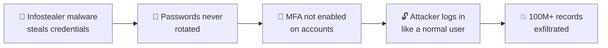
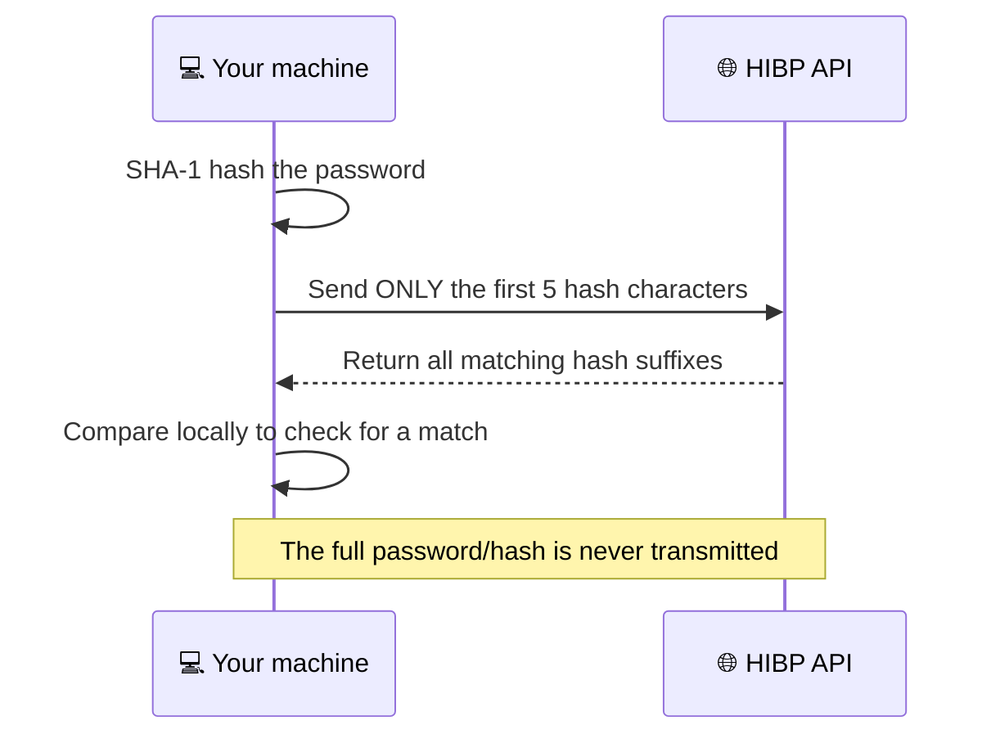

<div align="center">

# 🛡️ CredGuard

### Credential & MFA Exposure Auditor

**One missing second factor. 165+ organizations. 100 million+ records.**
*A cybersecurity case study paired with a hands-on auditing tool.*

<br>


<br>

[📖 Case Study](#-the-case-study) •
[🔐 The Tool](#-the-tool) •
[🚀 Quick Start](#-quick-start) •
[🖥️ Sample Output](#️-sample-output) •
[🎯 Design Notes](#-design-notes) •
[📚 References](#-references)

</div>

---

## 📖 The Case Study

Between **February and October 2024**, attackers tracked as **UNC5537** breached **165+ organizations**, including **AT&T** and **Ticketmaster**, through their Snowflake customer accounts. The records of **over 100 million people** were exposed. Connor Moucka pleaded guilty to running the campaign in **August 2026**.

> 🚨 **No vulnerability in the Snowflake platform was ever exploited.**
> The attackers simply *logged in*.

### 🔗 How the attack chain worked



### 🧩 Key takeaways

| 🎯 What happened | 💡 Why it matters |
|---|---|
| Credentials were stolen **years earlier** by infostealer malware | Identity, not infrastructure, is the modern attack surface |
| Passwords were **never rotated** after exposure | Credential hygiene is a recurring, *fixable* thread across breaches |
| **MFA was not enabled** on the targeted accounts | A single missing second factor led to a 100M-record breach |
| Attackers logged in like legitimate users, **no exploit needed** | These are cheap, high-impact checks any team can run today |

---

## 🔐 The Tool

> The root cause wasn't a software flaw. It was **exposed credentials and missing MFA**.
> CredGuard audits exactly that risk, **locally and safely**.

### ✨ Features

| Command | What it does |
|---|---|
| 🔎 **`check-password`** | Tests a password against [Have I Been Pwned](https://haveibeenpwned.com/Passwords) using **k-anonymity**. Only the first 5 characters of the hash are sent, so your real password never leaves your machine |
| 📋 **`audit`** | Scans a CSV roster and flags every account that is **missing MFA**, running on **stale credentials**, or **already known to be exposed**, ranked by risk score |

📦 **Zero third-party dependencies.** Python standard library only.

### 🔒 How k-anonymity keeps your password private



---

## 🚀 Quick Start

### 1️⃣ Installation

```bash
git clone https://github.com/mayurchavan2/credguard.git
cd credguard
pip install -r requirements.txt   # nothing to install, stdlib only
```

### 2️⃣ Usage

```bash
# 🔎 Check a single password (input hidden, never stored)
python credguard.py check-password

# 📋 Audit an account roster
python credguard.py audit sample_accounts.csv

# 📤 Export as CSV
python credguard.py audit accounts.csv --output report.csv --format csv

# ⏱️ Set a custom password-rotation policy
python credguard.py audit accounts.csv --rotation-days 90
```

### 3️⃣ Input format

Your CSV should contain these columns:

```text
username, email, mfa_enabled, password_age_days, sensitivity, known_exposure
```

---

## 🖥️ Sample Output

```text
Risk    Username   Sensitivity   Findings
------  ---------  ------------  ----------------------------------------------------------------
142.5   jsmith     critical      No MFA enabled; Credentials found in known breach data; stale (410d)
96.0    avargas    high          No MFA enabled; Credentials found in known breach data
0.0     mchen      high          No issues found
```

> 🔴 Higher risk score = fix it first.

---

## 📁 Repository Structure

```text
.
├── credguard.py         🔐 Credential & MFA exposure auditor (CLI tool)
├── sample_accounts.csv  📋 Example account roster for the audit command
├── requirements.txt     📦 Dependencies (stdlib only)
├── LICENSE              📜 MIT License
└── README.md            📖 You are here
```

---

## 🎯 Design Notes

| Principle | How CredGuard delivers it |
|---|---|
| 🚫 **No offensive functionality** | Never logs into any system, guesses credentials, or targets accounts it doesn't own |
| 🔐 **Privacy-preserving by design** | k-anonymity means no password is ever transmitted in full |
| 🧩 **Extensible** | Risk-weighting constants at the top of `credguard.py` are easy to tune for your own rubric |
| 📦 **Lightweight** | Standard library only, so it runs anywhere Python 3.8+ does |

---

## 📚 References

- 📰 The Hacker News: *Snowflake Hacker Pleads Guilty*, August 2026
- 📰 BleepingComputer: *Canadian pleads guilty to Snowflake cloud data-theft attacks*, August 2026
- 🔬 Mandiant / Google Cloud: UNC5537 threat research
- 🔑 Have I Been Pwned: Pwned Passwords API documentation (k-anonymity model)

---

## 🤝 Contributing

Ideas, issues and pull requests are welcome! If you have a suggestion, such as tuning the risk weights or supporting more input formats, feel free to open an issue.

## 📜 License

Released under the **MIT License**. See [LICENSE](LICENSE) for details.

---

<div align="center">

*🎓 Prepared as cybersecurity coursework, built to catch the same gap that took down 165 companies.*

**If you found this useful, consider leaving a ⭐**

</div>
